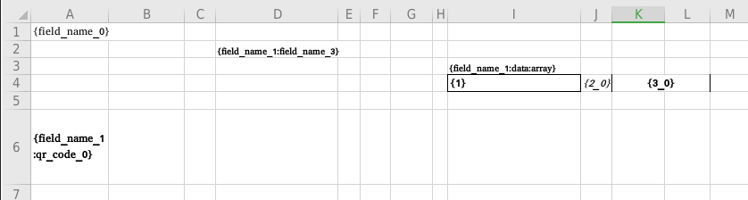
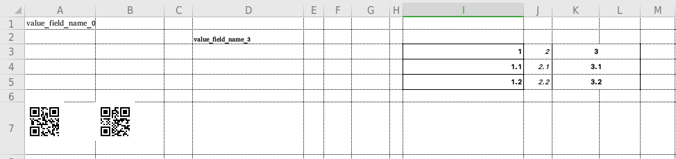

ПЕРЕПИСАТЬ

## XLSX-TEMPLATER

Шаблонизатор для заполнения excel файла данными.
Шаблонизатор поддерживает:

1. Вставку простых значений
2. Вставку таблиц
3. Вставка qr кодов
4. Вставка png изображений
5. Заполнение многостраничных шаблонов

Для заполнения данные должны быть представлены в формате позволяющем серилизацию (json, yml и т.д.). Для корректного заполнения excel файл данными, файл должен содержать плейсхолдоры, в тех клетках куда необходимо подставить значение.

## Placeholders

Плейсхолдер это строка внутри `{ }`, состоящая из ключей, разеделенных `:`, по данным ключам шаблонизатор определяет:

- расположение значения в данных - необходимо полседовательно перечислить через `:` ключи полей в данных до необходимого значения

**Пример:**

_Данные:_

```json
{
    "foo": "value1",
    "bar":{
      "foo": "value2",
    }
}
```

| плейсхолдер | значение |
| :---------: | :------: |
|    {foo}    |  value1  |
|  {bar:foo}  |  value2  |

- тип вставляемого значения - указывется полседним ключом

TODO

шаблон



данные для заполнения

```json
{
    "field_name_0": "value_field_name_0",
    "field_name_1":{
      "field_name_1": "value_field_name_1_1",
      "array_1":[
        {
          "1":1.0,
          "2_0":2.0,
          "3_0":3.0
        },
        {
          "1":1.1,
          "2_0":2.1,
          "3_0":3.1
        },
        {
          "1":1.2,
          "2_0":2.2,
          "3_0":3.2
        }
      ],
      "qr_code_1":[
        "https://t.me/geoirb",
        "https://github.com/geoirb"
      ]
    },
    "qr_code_0":[
        "https://t.me/geoirb",
        "https://github.com/geoirb"
    ],
    "image_0":"data:image/png;base64,iVBORw0KGg...",
}
```

результат



### Gratitude

- github.com/qax-os/excelize
- github.com/skip2/go-qrcode
