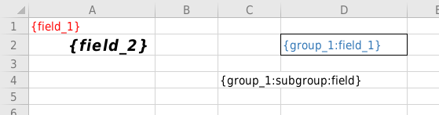
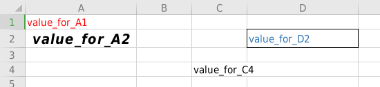
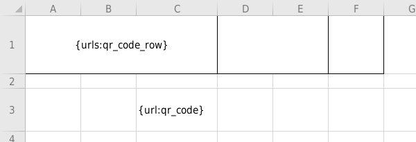
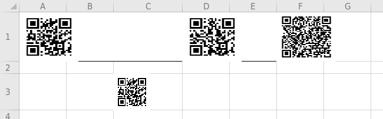
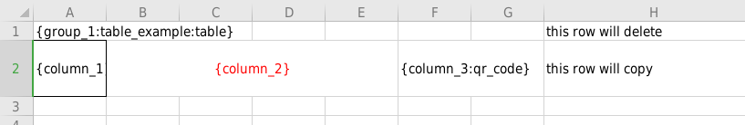
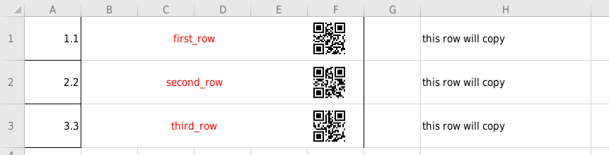

ПЕРЕПИСАТЬ

## XLSX-TEMPLATER

Шаблонизатор для заполнения excel файла данными.

Шаблонизатор поддерживает:
* Вставки простых значений
* Вставки таблиц
* Вставки qr кода
* Вставки несколько qr кодов в строку
* Вставки png изображений
* Значения по умолчанию
* Заполнение многостраничных шаблонов

Для заполнения данные должны быть представлены в формате, позволяющем сериализацию: json, yml и т.д. 

## Placeholders

Для корректного заполнения excel файла данными, файл должен содержать плейсхолдeры, в тех клетках, куда необходимо подставить значение. Плейсхолдер задает стиль подставляемого значения.

Плейсхолдер - это строка внутри `{ }`, состоящая из ключей типа `([_a-zA-Z0-9]+)`, разеделенных `:`, по ключам шаблонизатор определяет:
- путь до значения - необходимо последовательно перечислить через `:` ключи полей в данных до необходимого значения
- тип вставляемого значения, указывется последним ключом
  
| тип значения                           | ключ        | значение по умолчанию | тип данных       | описание                                                                                            |
|----------------------------------------|-------------|-----------------------|------------------|-----------------------------------------------------------------------------------------------------|
| простое значение                       |             | " "                   | любой            | будет вставлено все,что лежит по пути из плейсхолдера                                               |
| qr код                                 | qr_code     | " "                   | не пустая строка | на основе значения будет сгенерирован и вставлен qr код, размер qr кода определяются высотой строки |
| несколько qr коды для вставку в строку | qr_code_row |                       | массив строк     | массив qr кодов будет сгенерирован и вставлен в строку начиная с позиции плейсхолдера               |
| изображение                            | image       | прозрачный пиксель    | base64-encoded PNG | плейсхолдер будет заменен на изображение  
| таблица                                | table       |                       | массив объектов  | !!! строка с данным плейсхолдером будет удалена !!! из каждого объекта массива будет сгенерирована строка таблицы, для этого на следующей строке необходимо прописать плейсхолдеры, данная строка показывает где внутри объекта массива находтся данные, а так же задает стиль таблицы |

Простое значение:

_Данные_

```json
{
  "field_1": "value_for_A1",
  "field_2": "value_for_A2",
  "group_1": {
    "field_1": "value_for_D2",
    "subgroup": {
      "field": "value_for_C4"
    }
}
```

_Шаблон_



_Результат_



Qr код:

_Данные_

```json
{
  "urls": [
		"https://t.me/geoirb",
		"https://github.com/geoirb",
		"https://github.com/geoirb/excel-templater/blob/master/README.md"
	],
	"url": "https://t.me/geoirb"
}
```

_Шаблон_



_Результат_




Таблица:

_Данные_

```json
{
	"group_1": {
		"table_example": [
			{
				"column_1": 1.1,
				"column_2": "first_row",
				"column_3": "first_row",
				"column_4": 0.0
			},
			{
				"column_1": 2.2,
				"column_2": "second_row",
				"column_3": "second_row",
				"column_4": 0.1
			},
			{
				"column_1": 3.3,
				"column_2": "third_row",
				"column_3": "third_row",
				"column_4": 0.2
			}
		]
	}
}
```

_Шаблон_



_Результат_



### Gratitude

- github.com/qax-os/excelize
- github.com/skip2/go-qrcode
